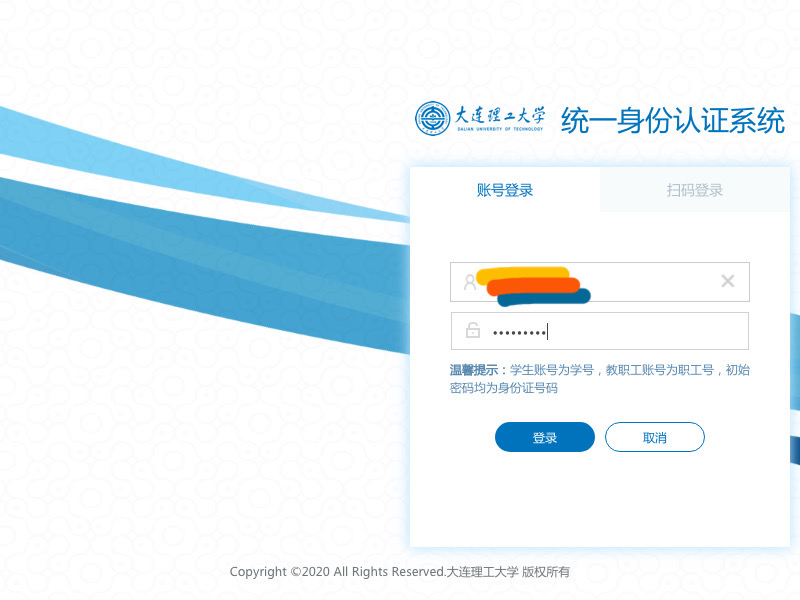
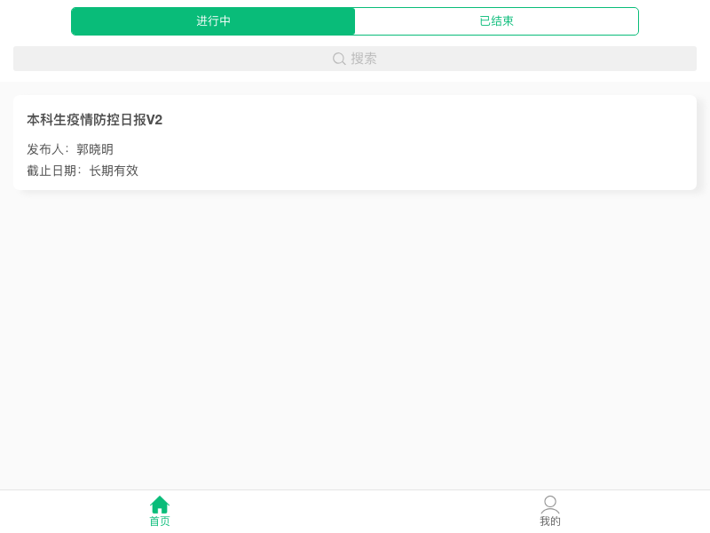
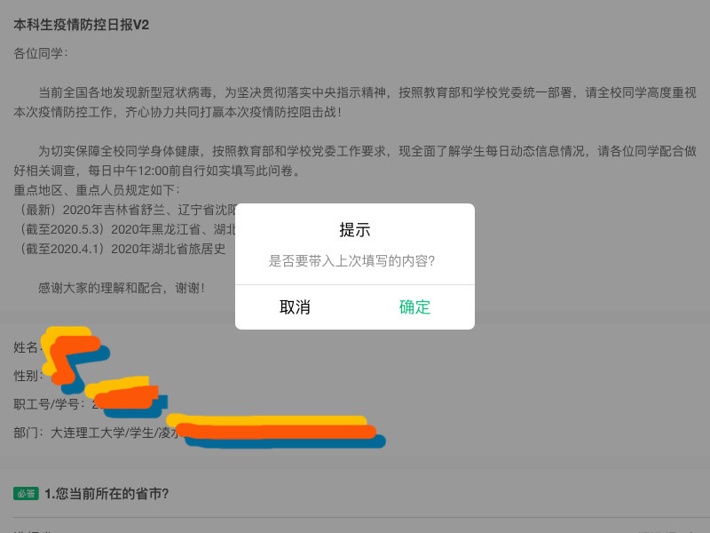
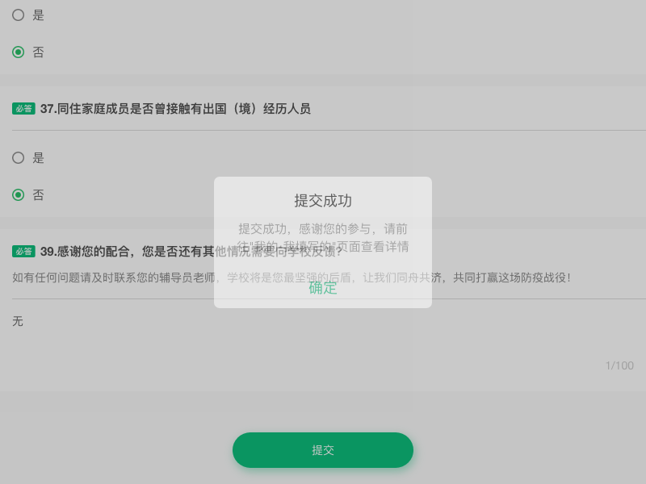

# lovedk

此项目用于i大工健康上报自动打卡，提供[JavaScript](https://github.com/cjhahaha/lovedk/tree/master/js) 和 [Python](https://github.com/cjhahaha/lovedk/tree/master/py) 两个版本。

## 🐍 python

### step 1. install

```shell
pip3 install -r requirements.txt
```

对于 Ubuntu 用户，按照 https://github.com/miyakogi/pyppeteer/issues/82 需要安装以下依赖
```shell
sudo apt-get install gconf-service libasound2 libatk1.0-0 libc6 libcairo2 libcups2 libdbus-1-3 libexpat1 libfontconfig1 libgcc1 libgconf-2-4 libgdk-pixbuf2.0-0 libglib2.0-0 libgtk-3-0 libnspr4 libpango-1.0-0 libpangocairo-1.0-0 libstdc++6 libx11-6 libx11-xcb1 libxcb1 libxcomposite1 libxcursor1 libxdamage1 libxext6 libxfixes3 libxi6 libxrandr2 libxrender1 libxss1 libxtst6 ca-certificates fonts-liberation libappindicator1 libnss3 lsb-release xdg-utils wget
```


### step 2. config

方法一：在 `lovedk.py` 的 69-70 行直接改变变量内容。

```python
username = '<your_username>'
password = '<your_password>'
```

方法二：使用命令行参数传入

```shell
python3 lovedk.py <your_username> <your_password>
```


## 🔆 JavaScript

### step 1. install

```shell
# use npm
npm install
# or use yarn
yarn
```
对于 Ubuntu 用户，还是需要安装那么一堆。
```shell
sudo apt-get install gconf-service libasound2 libatk1.0-0 libc6 libcairo2 libcups2 libdbus-1-3 libexpat1 libfontconfig1 libgcc1 libgconf-2-4 libgdk-pixbuf2.0-0 libglib2.0-0 libgtk-3-0 libnspr4 libpango-1.0-0 libpangocairo-1.0-0 libstdc++6 libx11-6 libx11-xcb1 libxcb1 libxcomposite1 libxcursor1 libxdamage1 libxext6 libxfixes3 libxi6 libxrandr2 libxrender1 libxss1 libxtst6 ca-certificates fonts-liberation libappindicator1 libnss3 lsb-release xdg-utils wget
```


### step 2. config

方法一：在 `lovedk.js` 的57-58行直接改变变量内容。

```python
let username = '';
let password = '';
```

方法二：使用命令行参数传入

```shell
node lovedk.js <your_username> <your_password>
```


## 说明

如果将`DEBUG=True`，则每步应该输出一下图片。

- step_1

  

- step_2

  

- step_3

  

- step_4

  

- step_5

  


## 其他

如果有问题请提 issue。
欢迎发 pr。

